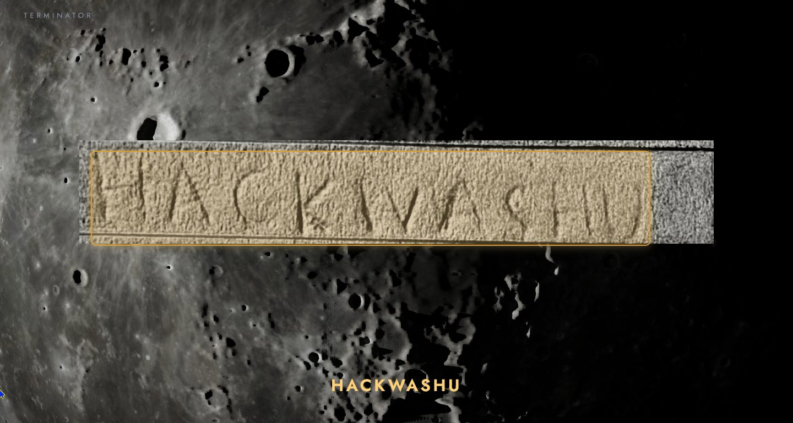
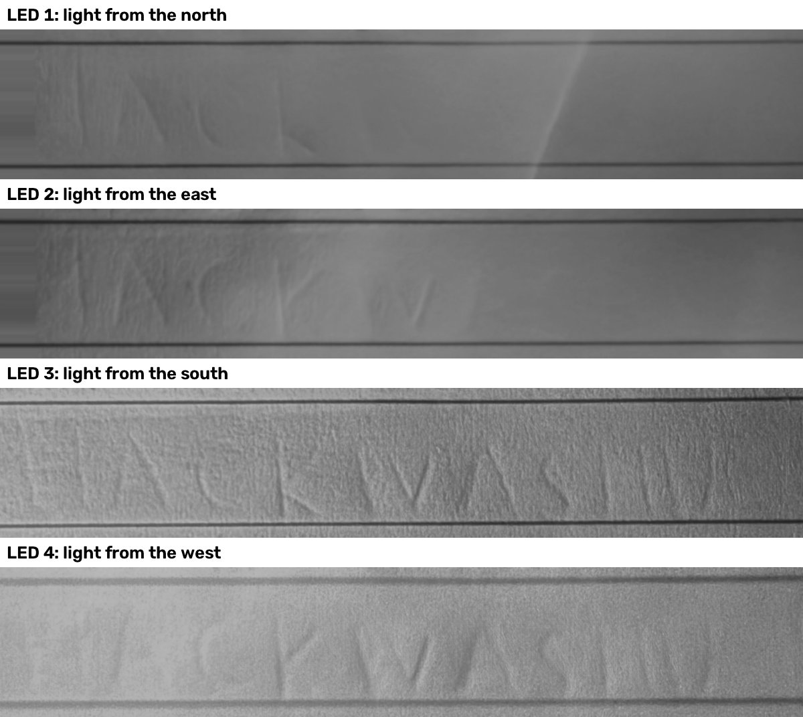
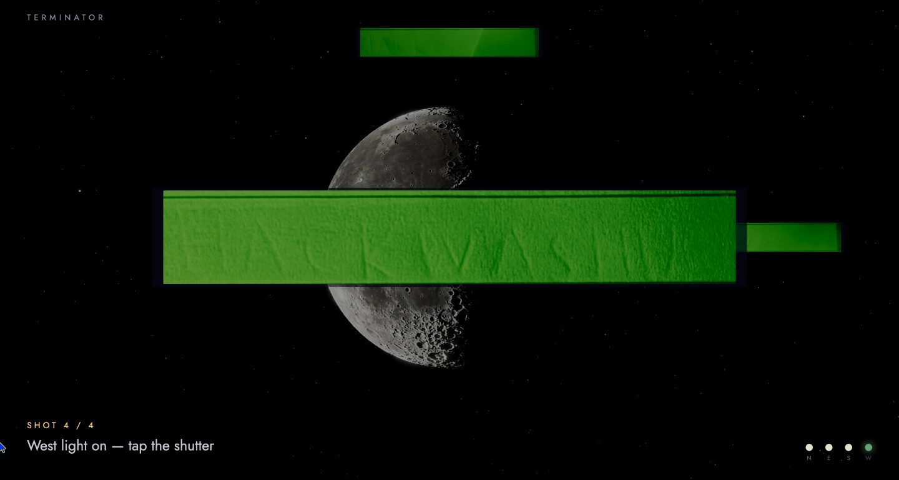
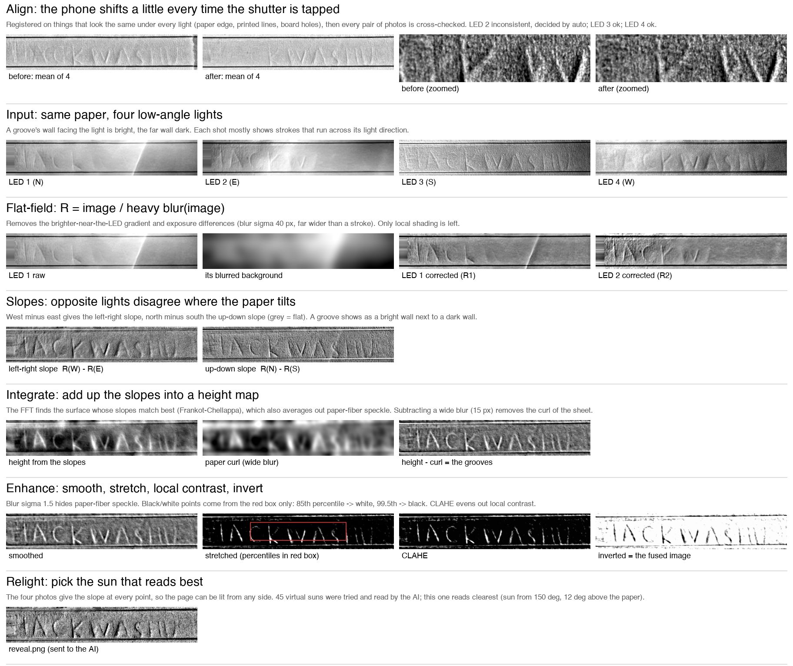
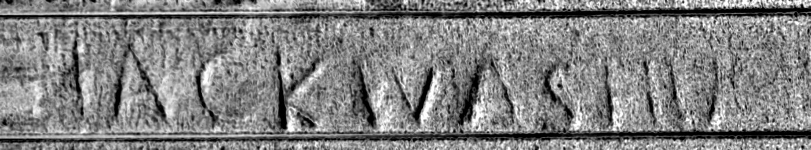

# Terminator

[](https://github.com/eericzhuang/HackWashU-Fly-Me-to-the-Moon/actions/workflows/ci.yml)

**Reading the invisible writing a pen leaves behind, the way astronomers read the Moon.**
HackWashU 2026 · theme: *Fly Me to the Moon*



Write something on a notepad and tear the page off. The next page looks blank, but the pen
pressed a groove into it. Terminator lights that page from four low angles, takes four photos with
an iPhone, turns the tiny shadows into a picture of the handwriting, and has an AI read it out loud.

## Why "Terminator", and what it has to do with the Moon

The terminator is the line between day and night on the Moon. At full moon the Sun is straight
overhead, nothing casts a shadow, and the surface looks flat. Along the terminator the sunlight
skims in almost sideways, every crater throws a long shadow, and suddenly you can see the terrain.
That's how Galileo first worked out that the Moon has mountains, and even estimated their height
from the length of their shadows.

A pressed-in page is the same problem at a much smaller scale. Under ordinary room light it's
"full moon": no shadows, nothing to see. Put a light flat on the table and the page becomes a tiny
landscape at the terminator. So we took the prompt fairly literally:

- **The Moon and light:** the whole method is lunar observation: low sun, long shadows, read the
  relief. The four LEDs are four suns.
- **Cycles:** the capture walks the light around the page (north, east, south, west). On screen
  the Moon's phase turns with it, one quarter per photo.
- **Distance and exploration:** you never touch the writing. Everything comes from light
  and shadow, just like mapping the Moon from 384,000 km away.
- **Fly me to the Moon:** at the end the camera dives to the lunar surface, the recovered page
  lands there, and you can grab the Sun with your mouse and relight it yourself.

## How it works



1. **Light.** Four LEDs lie flat on the table around the paper, about 5 cm from its edges, so
   the light arrives at a grazing angle of roughly 5–15°. An Arduino switches them one at a time.
2. **Capture.** An iPhone is fixed above the page. For each LED the Mac plays a chime and you tap
   the shutter (Night mode). The photo is pulled straight off the phone over USB
   (`pymobiledevice3`), cropped, and shown in the web UI as it lands.
   Each light only shows the strokes that cross its direction, which is why there are four.

   
3. **Align.** Tapping the shutter nudges the phone, so the four photos don't line up. We register
   them on the paper edge and the ruled lines, reject fits that aren't physically plausible, and
   cross-check every pair of photos against each other (loop closure), which catches a photo that
   slid 100 px.
4. **Recover the surface (photometric stereo).** Divide each photo by a heavy blur of itself to
   remove the uneven lighting (flat-field). The difference between opposite lights gives the slope
   of the paper at every point: west minus east for left/right, north minus south for up/down.
   Integrating the slopes (Frankot–Chellappa, in the Fourier domain) gives a height map, and
   subtracting its blur removes the curl of the sheet and leaves just the grooves.
5. **Relight.** With the slope known everywhere, we can render the page under a virtual sun from
   any direction. We try about 45 sun positions, send each to Google Vision, and keep the one whose
   reading agrees best with the others. That image is `reveal.png`.
6. **Read and show.** The web UI walks through every step on screen, then dives to the Moon, reads
   the page with Google Vision, boxes the word and says it with the browser's speech synthesis.



Result from a real scan. `HACKWASHU` was written with a ballpoint on the page above, which was then
torn off; this is the page underneath, and Google Vision reads it as `HACKWASHU`:



## Hardware

| Part | Notes |
|---|---|
| Arduino Uno / SparkFun RedBoard | `arduino/terminator_leds/`: serial `'0'-'3'` lights one LED, `'x'` all off |
| 4 LEDs + 4 × 220 Ω | Same color; green works best (half the phone's pixels are green). Pins D2 north, D5 east, D3 south, D4 west |
| iPhone on a fixed stand, pointing down | Native Camera app, Night mode; USB to the Mac |
| A dark room | Or a jacket over the rig |

Tip: long-press the camera preview for **AE/AF lock** before the first photo. Under the dimmer
LEDs the iPhone otherwise switches to a different sensor mode (more zoom, higher ISO), and those
photos come out blurrier and shifted. `terminator.phone` warns when that happens.

## Running it

```bash
pip install -r requirements.txt
cd web && npm ci && cp .env.example .env.local   # put GOOGLE_API_KEY in .env.local
```

**Without hardware** (synthetic scan that ships with the repo):

```bash
python tools/simulate.py "Meet me on the moon at 9"   # writes out/sim/
cd web && npm run dev
# open http://localhost:5173/?replay=sim&pace=2500
```

**With the rig** (Arduino and iPhone on USB, web UI open at http://localhost:5173):

```bash
cd web && npm run dev
python -m terminator.phone            # tap the shutter each time a light comes on
```

In the browser: click once to enable sound, → / Space to page through the steps, drag the sun
to relight the page, R to replay, M to mute, F for fullscreen.

Other entry points: `python -m terminator.reveal <folder>` (combine any four photos),
`python -m terminator.relight <folder>` (virtual-sun relight), `python tools/import_photos.py`
(four hand-taken photos), `python -m terminator.phone --redo out/scan_...` (re-run a past scan).
[docs/scan-contract.md](docs/scan-contract.md) has the full file contract between the Python side and the web UI.

Tests: `cd web && npm test` (web UI) and the simulated scan in `.github/workflows/ci.yml`
(processing), both run on every push.

## Repo layout

```
arduino/        LED controller sketch + a wiring test
terminator/     capture (phone.py, scan.py), alignment (align.py, review.py),
                processing (reveal.py, relight.py, stages.py)
tools/          simulator, photo import, step-by-step explainer
web/            the show: Vite + TypeScript + three.js, Google Vision proxy, local audio
out/sim/        a synthetic scan for trying the UI without hardware
docs/dev/       build notes: web UI spec, implementation plans, checklist
```

The two halves only talk through a scan folder: Python writes `out/latest/` (photos, `meta.json`,
`reveal.png`, step pages), the web UI polls it.

## What we learned

- The light has to lie flat. LEDs standing upright on a breadboard light the page from above and
  wash the grooves out, however bright or dim they are.
- Ruled paper fools image registration: it can slide a photo along the lines and still score
  well, so we check that every fit is physically plausible.
- A single fused image reads worse than the best relit one. Letting the AI choose the sun angle
  took one real scan from "ACKWASH" to "HACKWASH", and later scans read the full "HACKWASHU".

## Team

- [@eericzhuang](https://github.com/eericzhuang): hardware, Arduino, capture, image processing
- [@AlexanderYWHDu](https://github.com/AlexanderYWHDu): web UI, 3D Moon, sound, AI reading and speech

Moon imagery: NASA SVS CGI Moon Kit. Stars: Yale Bright Star Catalog.
